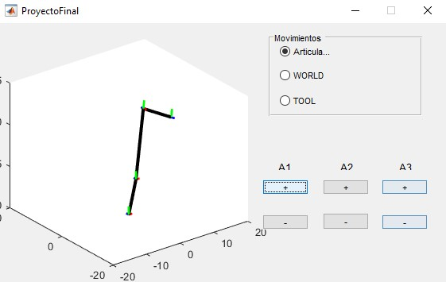
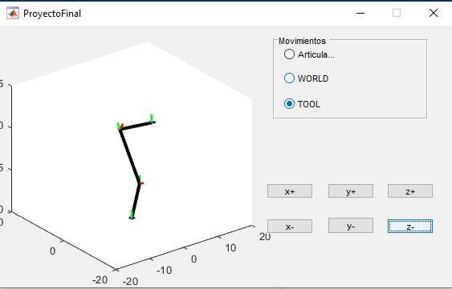
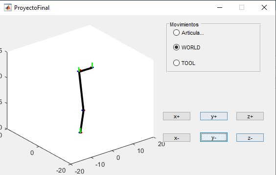
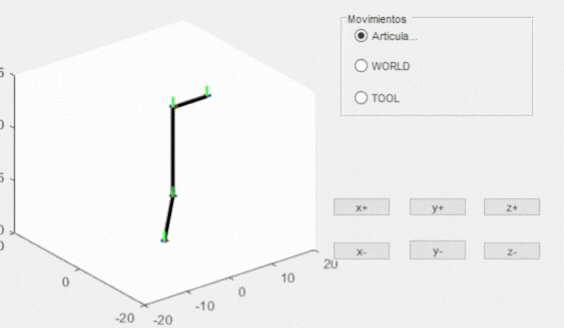

# scara-robot-simulator

3-DOF SCARA robot simulator built from scratch in MATLAB with kinematics via homogeneous transformation matrices, analytical inverse kinematics, and an interactive GUI for joint and Cartesian control. Academic project from the Computational Tools course at UPIITA - IPN (2020).

---

## What it does

The simulator models a SCARA robot with three degrees of freedom. Given joint angles, it computes the end-effector position through chained homogeneous transformations and renders the robot in 3D with color-coded reference frames at each joint. Given a target Cartesian position, it solves the joint angles analytically and updates the visualization in real time.

Three control modes are available through the GUI:
- **Joint mode** — increment or decrement each joint angle directly (±1° per step)
- **Tool mode** — move the end-effector relative to the tool frame in X, Y, Z (±0.25 units per step); inverse kinematics runs automatically
- **World mode** — move the end-effector in global Cartesian coordinates X, Y, Z (±0.25 units per step); inverse kinematics runs automatically

---

## Screenshots

| Joint mode | Tool mode | World mode |
|---|---|---|
|  |  |  |

The green dots are the coordinate frame origins at each joint. The GIF below shows the robot responding to commands in real time:



---

## Architecture

```
Trans.m          - builds 4x4 homogeneous transformation matrices (Tx, Ty, Tz, Rx, Ry, Rz)
RotaX/Y/Z.m      - 3x3 rotation matrices for each axis
ScaraRobot.m     - forward kinematics: chains T01, T12, T23 → T03
CinInv2gdl.m     - inverse kinematics for the 2-DOF planar subproblem (law of cosines)
CI3GDL.m         - full 3-DOF inverse kinematics (decomposes into theta1 via atan2 + CinInv2gdl)
DrawRef.m        - renders a coordinate frame from a homogeneous matrix (red=X, blue=Y, green=Z)
DrawRobots.m     - renders the full robot by accumulating transformations and drawing each link
ProyectoFinal.m  - GUIDE GUI: connects all modules, handles control mode switching
```

---

## Kinematics

**Forward kinematics** (`ScaraRobot.m`)

The robot is defined by three transformations with fixed link offsets:

```
T01 = Rz(a0) * [I | (2, 0, 4)]    - base rotation + vertical offset
T12 = Ry(a1) * [I | (0, 0, 8.5)]  - first arm link
T23 = Ry(a2) * [I | (8, 0, 0)]    - second arm link (reoriented)
T03 = T01 * T12 * T23             - end-effector pose
```

**Inverse kinematics** (`CI3GDL.m` + `CinInv2gdl.m`)

Given target (x, y, z):
1. theta1 = atan2(y, x) solved directly from the base geometry.
2. The remaining position is projected into the plane of the second and third links.
3. theta2, theta3 are solved analytically using the law of cosines with L1=8.5, L2=8.

---

## Files

| File | Description |
|------|-------------|
| `ProyectoFinal.m` | Main GUI file (requires `ProyectoFinal.fig`) |
| `ProyectoFinal.fig` | GUIDE layout file |
| `ScaraRobot.m` | Forward kinematics |
| `CI3GDL.m` | 3-DOF inverse kinematics |
| `CinInv2gdl.m` | 2-DOF planar inverse kinematics (law of cosines) |
| `Trans.m` | Homogeneous transformation matrix builder |
| `RotaX.m` / `RotaY.m` / `RotaZ.m` | Rotation matrices |
| `DrawRobots.m` | Robot renderer |
| `DrawRef.m` | Reference frame renderer |

---

## Honest reflections

The hardest parts were the homogeneous transformation matrices and getting the inverse kinematics to produce angles that actually matched what the forward kinematics expected. The decomposition was based on solving theta1 first, then projecting the remaining problem into a 2-DOF planar case which only made sense after drawing it out several times. A friend helped debug some issues with global matrix state in the GUI, which was a separate kind of problem: MATLAB's GUIDE handle structure is not obvious until it breaks in a confusing way.

MATLAB itself felt strange at first because it is somewhere between C/C++ and a high-level scripting language, with syntax rules that didn't follow either cleanly. It grew on me later once I started seeing how much you could do with it and how strong the tooling and community are. This project was one of the first times I felt like I was building something that actually modeled a physical system, not just computing numbers.

---

## Requirements

MATLAB with GUIDE support. Tested on MATLAB R2020a. No additional toolboxes required.

To run: open `ProyectoFinal.fig` in GUIDE or call `ProyectoFinal` from the MATLAB command window.